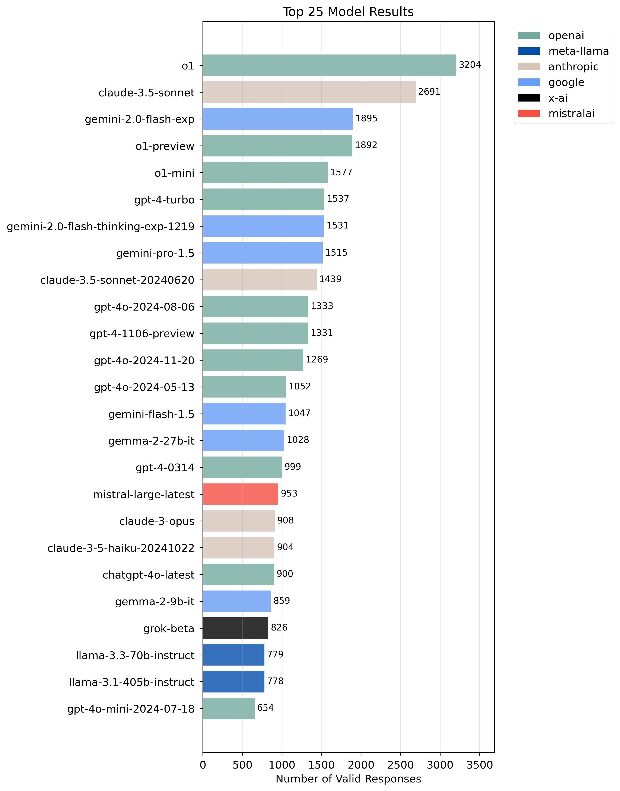

# Aidan Bench
Some models feel competent despite under-scoring on benchmarks like MMLU, GPQA, MATH, or NIAH.

*Aidan Bench* rewards:

1. Creativity
2. Reliability
3. Contextual attention
4. Instruction following

**Aidan Bench is weakly correlated with LMSYS Arena scores, has no score ceiling, and aligns with real-world open-ended use.**

# Methodology

We give LLMs a set of open-ended questions spanning various domains:

```python
"Provide an explanation for Japan's Lost Decades.",
"How might you use a brick and a blanket?",
"What architectural features might you include in a tasteful house?",
"Propose a solution to Los Angeles traffic.",
"What activities might I include at a party for firefighters?",
"How could we redesign schools to better prepare students for the 22nd century?",
# ... and many more
```

For each question, we ask the model to generate novel answers while avoiding previous responses. The benchmark continues generating answers until either:

1. The answer becomes incoherent ($C \leq 15/100$)
2. The answer is too similar to previous responses ($N \leq 0.15$)

## Scoring System

Given a language model $\mathcal{M}$ and question $q$, we compute the score $S_{\mathcal{M}}(q)$ as:

$$
S_{\mathcal{M}}(q) = \max\{n \in \mathbb{N} : \forall i \leq n, r_i \in V(R_{i-1})\}
$$

where $r_i = \mathcal{M}(q, R_{i-1})$ represents the $i$-th generated response and $R_i = \{r_1, ..., r_i\}$ captures the response history. The validity function $V(R)$ enforces our termination criteria:

$$
V(R) = \{r : C(r) > \tau_c \land N(r, R) > \tau_n\}
$$

**Coherence Score** $C(r)$: Each response is evaluated by a judge model $\mathcal{J}$ (o1-mini) on a scale of $[0, 100]$:

   $$
   C(r) = \mathcal{J}(q, r)
   $$

**Novelty Score** $N(r, R)$: For each new response $r$, we compute:

   $$
   N(r, R) = 1 - \max_{r' \in R} \frac{e(r) \cdot e(r')}{\|e(r)\| \|e(r')\|}
   $$

   where $e(r)$ denotes the response embedding.

The final AidanBench score aggregates performance across all questions $Q$:

$$
S_{\mathcal{M}} = \sum_{q \in Q} S_{\mathcal{M}}(q)
$$


# Results

Here are the latest benchmark results across various models:



We test models at temperature=0.7.

# Setup

## Prerequisites

- Python 3.x
- OpenAI API key
- OpenRouter API key

## Installation

1. Clone the repository:
   ```bash
   git clone https://github.com/aidanmclaughlin/Aidan-Bench.git
   cd Aidan-Bench
   ```

2. Install required packages:
   ```bash
   pip install numpy openai colorama retry
   ```

3. Set up environment variables:
   ```bash
   export OPENAI_API_KEY="your-openai-key"
   export OPEN_ROUTER_KEY="your-openrouter-key"
   ```

## Running the Benchmark

Run the benchmark with:
```bash
python main.py
```

The script will guide you through several choices:

1. Select model(s) to benchmark
   - Choose from a list of supported models
   - Option to test multiple models in sequence

2. Configure test parameters
   - Threading mode (multi-threaded or single-threaded)
   - Temperature setting (default: 0.7)
   - Number of questions to test
   - Use of LLM judge for similarity scoring

3. Configure thresholds
   The benchmark uses three key thresholds:
   
   Coherence threshold $\tau_c$ controls minimum answer quality
   
   Embedding threshold $\tau_n$ prevents semantic redundancy
   
   LLM similarity threshold (optional) provides additional diversity checking

Results will be saved to `results.json` and can be visualized using the included visualization tool.

## Visualization

After running the benchmark, you can visualize results using the included visualization tool:

```bash
cd visualize_results
python -m http.server 8000
```

Then open `http://localhost:8000/visualization` in your browser to explore the results interactively.

